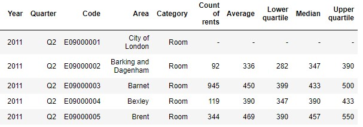
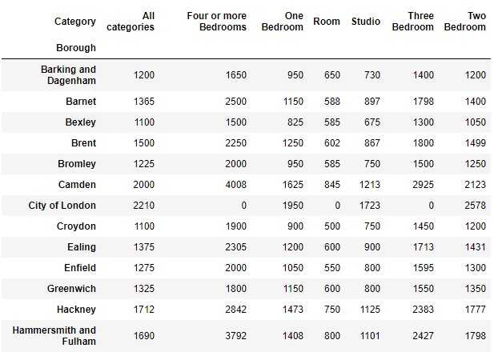
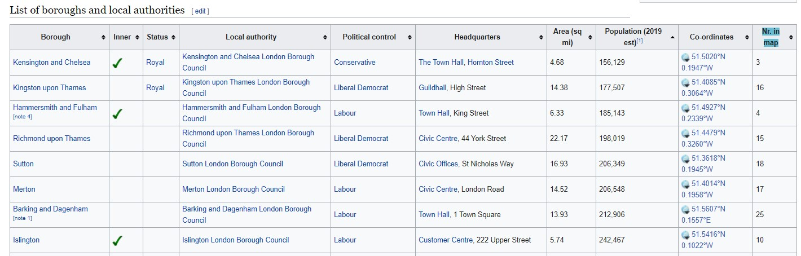
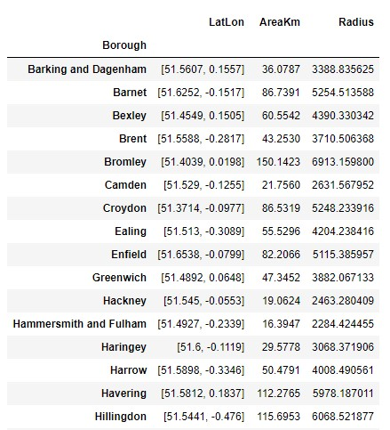
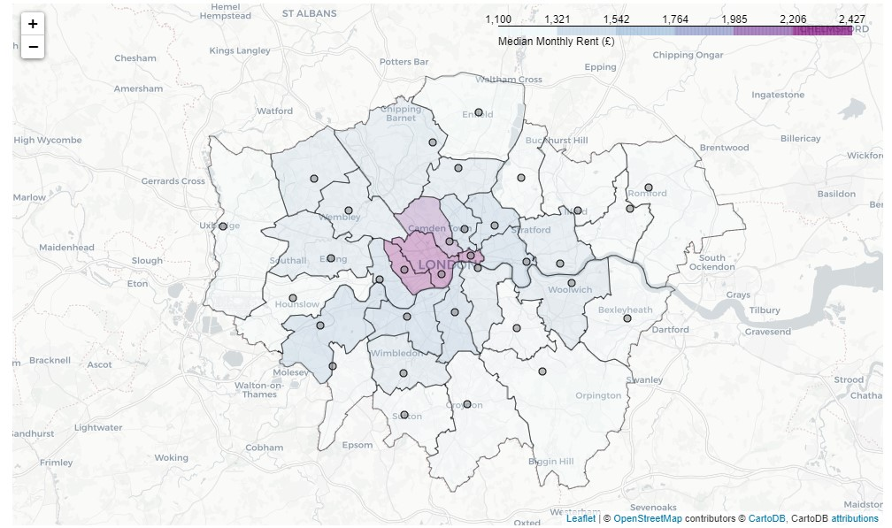
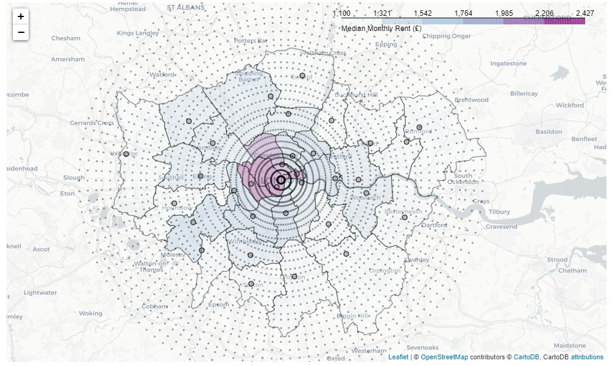
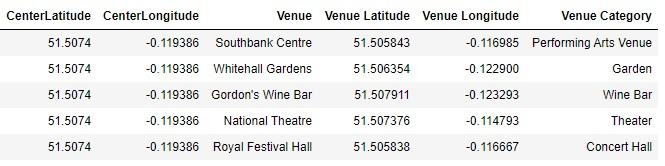
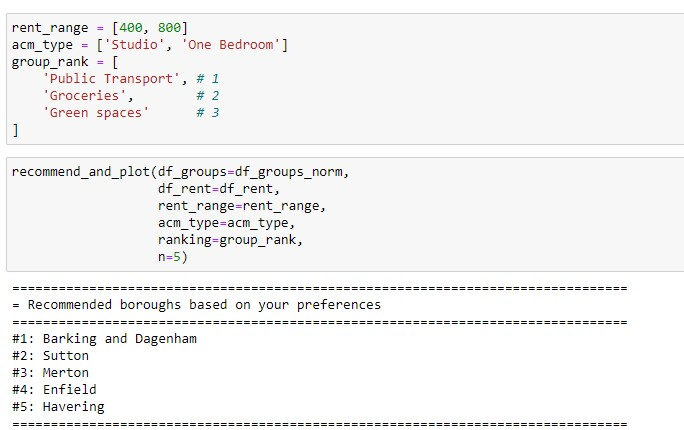
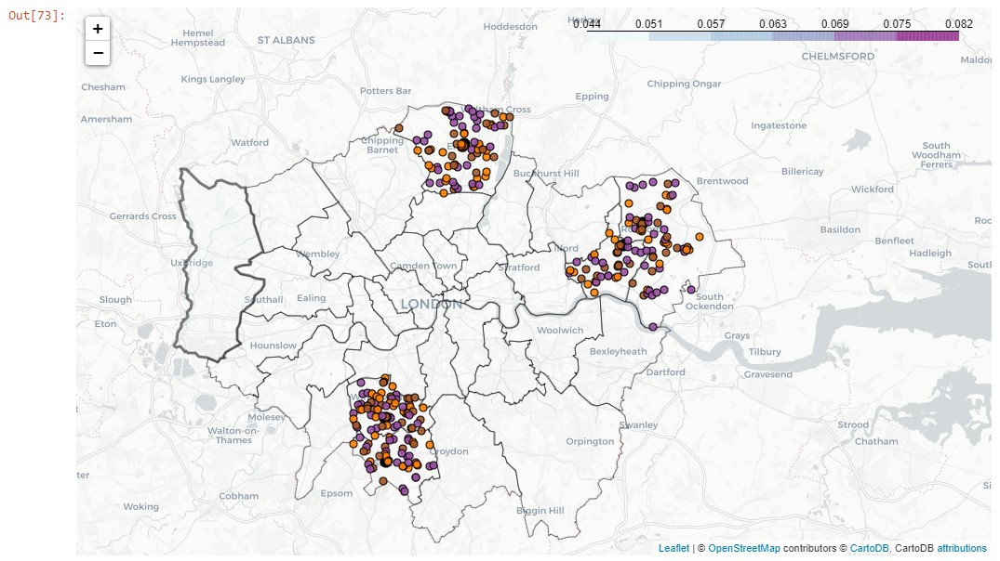

# IBM Data Science Professional Certificate
## Capstone Project: Recommendation of London Boroughs

## Introduction

A very common problem for a lot of people is choosing where to live in a big city. While rent is an important factor when deciding which area to live in, there are a lot of other subjective criteria based on personal preferrences - e.g. what kind of venues would one like to have close to home (shopping, bars, parks, etc.), are there parks nearby, etc. There are various solutions to this problem - online search, asking friends, visiting the areas yourself - all of these are rather time consuming and subjective. However, this problem can be tackled using a data-driven approach by  creating a recommendation engine that would suggest areas that match the user-defined criteria.

London, UK is one of the largest cities in the world and contains 33 areas (also known as boroughs). This presents a good use case for implementing such an algorithm and testing whether it makes sensible recommendations.

## Data

In order to build a recommender, we need to have some information about the rents in London, borough geography, and what characteristics of each borough. While rent and geographical data are quite objective, there are many different ways to characterise boroughs. For this project, however, we are going to use information about the venues retrieved from Foursquare API. 

### Data Sources

The following data sources are going to be used to recommend Greater London boroughs to the user:  

1. Rent data - available from London Datastore in *.xls format: [Average Private Rents, Borough](https://data.london.gov.uk/dataset/average-private-rents-borough)
2. List of London Boroughs and their geographical coordinates, available from Wikipedia (html table): [List of London Boroughs](https://en.wikipedia.org/wiki/List_of_London_boroughs)
3. Greater London borough boundaries in GeoJSON format, available [here](https://joshuaboyd1.carto.com/tables/london_boroughs_proper/public)
4. Information on venues in Greater London area. Available via free version of [Foursquare API](https://developer.foursquare.com/).

### Data Cleaning

#### Rent Data

Rent data is retrieved from officiai [London Datastore](https://data.london.gov.uk/dataset/average-private-rents-borough) website which tracks average private rents per borough. The data is released quarterly. The rent information is provided for each borough and contains:

* Category - type of accommodation, e.g. Room, Studio, One Bedroom, Two Bedroom, etc.
* Average
* Lower quartile
* Median
* Upper quartile

Only latest available data is used, which at the time was first quareter of 2019. Also, we are going to use lower quartile, median, and upper quartile data instead of average to take into account the skewed nature of averages. In addition, aggregate areas (e.g. 'North West') are excluded. Median rents for 2019 Q1 for the first few boroghs are shown below

#### Borough Data

In additiona to rent data, we need to have some geographical data of the boroughs. Namely, we need to know the locations (i.e. center of the borough) as well as their boundaries. This will be required in order to determine which borough the venue belongs to. 

Information about boroughs and their geograpical centers can be found on [Wikipedia](https://en.wikipedia.org/wiki/List_of_London_boroughs). The data from the provided table is retrieved using `BeautifulSoup` in Python and converted to a pandas DataFrame:

In addition, a theorethical radius of the borough is calculated using area:

$$
r = \sqrt{\frac{S}{\pi}},
$$
where $r$ is radius, $S$ is area, and $\pi$ is ~3.1459... This calculation of the radius approximates each borough as a circle and will be used in the next step when retrieving venue data.

The borough data combined with rent data can then be conveniently shown on a map:

#### Venue data

In order to characterize boroughs we are going to use venue data available for free via [Foursquare Places API](https://developer.foursquare.com/). In order to retrieve the venues we need to provide the API with the location (longitude and latitude) and the radius within which we want to get all the venues. Unfortunately, the free API version limits the results to 50 per request. Given that there are likely much more venues within each borough, a different apprcoah is required.

While this approch is not the most effcient, without  apriori knowledge about the density of the venues the easiest solution was chosen - a grid scan of the entire London area. This was done by approximating the entire Greater London as a circle and dividing it into nine concentric rings. Each ring was divided into sub-rings depending on its location - more sub-rings in the inner rings, and less sub-rings in the outter rings. This was chosen assuming that the density of the venues is much larger in the central parts of London. The end result of this procedure is a set of concentric rings that covers the entire Greater London area:

We then create a point on each circle three degrees apart, which results in a grid of ~3500 locations that we then use to scan the entire area by iterating through each coordinate and sending it to Foursquare Places API's venues search endpoint. 

At the end of the scan we retrieve around 180,000 venues. However, as our search was not very efficient, a lot of them are duplicated. Dropping duplicate venues, we are left with 19,737 unique venues with the following information:

### Methodology

This section describes the methodology of the recommendation algorithm. The algorithm for this system is rather simple, but this is mainly due to the fact that we do not have a large sample of user data to do, for example, collaborative filtering. Therefore, we are relying on explicit input from a single user.

#### Data preparation
Each venue retrieved from the Foursquare API is mapped to a borough based on it's coordinates and borough's boundaries. This is implemented using a computation geometry Python package `shapely`. 

We then group each type of venue to nine large arbitrary groups:

1. __Going out__ - bars, pubs, night clubs.
2. __Green spaces__ - parks, gardens, trails, beaches, etc.
3. __Eating out__ - restaurants, cafes, coffee shops, brasseries, etc.
4. __Entertainment__ - theaters, museums, art galleries, zoos, bowling, etc.
5. __Shopping__ - stores, malls, arcades, boutiques, shops.
6. __Health and Sports__ - gyms, yoga studios, basketball courts, football courts, etc.
7. __Groceries__ - supermarkets, bodegas, liquor stores, etc.
8. __Public Transport__ - bus stops, tram stops, metro stops, train stations, etc.
9. __Other__ - a catch-all category for everything else

We then create a representation of each borough by calculating normalized density vector __*a*__ of venue groups, where each element is defined as:

$$
a_{i} = \frac{n_{i}}{N},
$$

where $n_{i}$ is the number of venues of the $i$th group in the borough, and N is total number of venues in the borough.  

#### Recommendation algorithm

The purpose of the algorithm is to recommend a list of boroughs to a user based on their specified preferences. 

Let $W$ be a venue matrix of dimensions $n \times m$, where every element represents a normalized density of venue group $j$ in a borough $i$:

$$W = \begin{bmatrix} a_{11} & ... & a_{1m} \\ ... & a_{ij} & ... \\ a_{n1} & ... & a_{nm} \end{bmatrix}$$

The user-provided preferences can be formally written as a column vector $p$:

$$p = \begin{bmatrix} p_{1} \\ ... \\ p_{m} \end{bmatrix}$$

Recommendation matrix $R$ then can be calculated as a matrix product:

$$R = W \times p  = \begin{bmatrix} r_{1} \\ ... \\ r_{m} \end{bmatrix}$$

This matrix is a column vector of length $n$ where each row represents the weight of each borough. The larger the weight, the closer the borough matches users preference. 

Given a number $N$ of boroughs we want to recommend, $N$ largest weights are selected and the list of boroughs are returned in an order from the highest weigh $r$ to the lowest.

#### Filtering venue matrix based

The venue density matrix $W$ is filtered in advance based on user's selection on upper and lower limits for rent: $m_{min}$ and $m_{max}$ and the accommodation type. The dataset for borough rent data contains first $q_{1}$ and third quartile $q_{3}$ information. Only the boroughs satisfying either of the below condition are kept in the $W$ matrix:
    
$$ \begin{align*}
  q_{1} \le m_{max} \land q_{3} \ge m_{max} \\ 
  q_{1} \le m_{min} \land q_{3} \ge m_{min} \\ 
\end{align*}
$$

# Results and discussion

We started with information about monthly rents for 33 London boroughs and combined it with data about venues within those boroughs retrieved from Foursquare API. Using grid-scanning we identified approx. 20,000 unique venues and grouped them into nine larger groups. 

Plotting the boroughs and venues on the map showed that the distribution of the venues was not uniform and most of them were concentrated in the central parts of London. We assigned each venue to a borough based on its lattitude and longitude, and boroughs geographical limits. By creating a normalized density vector of these venues for each borough, we effectively created a mathematical representation of the neighborhood that could then be used in an recommendation algorithm.

Using accommodation and rent preferences, and combining this data with venue density matrices of the boroughs we created a recommendation function that displays an arbitrary, user-defined, number of recommended boroughs with preferred venues overlaid on a map. 

This model is a good illustration of the general concept and could be extended to incorporate additional information. It could also be implemented as a user-friendly web application.

# Conclusion 

The purpose of this project was to create an algorithm that recommends a London neighborhood to a user based on their preferences. After cleaning data and performing exploratory data analysis, the process was synthesized to one function `recommend_and_plot` function which could be re-used in a dedicated application. This could be used to help people in the initial step of choosing where to live in London. 

Admittedly, this is a simplistic model as there are way more important data points that could be used (e.g. crime rate, congestion, air quality, etc.). Nonetheless, the algorithm works and is a good demonstration of general principles that can be used for combining different types of information together to come up with a recommendation. While not perfect, this algorithm could serve as one of the steps in a person's decision-making process when looking for a new place to rent in London.
